# GitHub Flow Sample

## About

GitHubを使い、Gitでの開発管理フローを学ぶ資料です。

基本的な流れとしては、

- (1) Issueを起こす
- (2) ブランチを切る
- (3) 実装を行う
- (4) プルリクエストを作成し、レビュー
- (5) マージ

というフローになります。

また基本運用としては`master`ブランチを主として、各拡張ごとに分かりやすい名前でブランチを切る運用とします。

今回は、`README.md`だけが作成されているリポジトリを使って`A`というクラスが実装された`A.hpp`という`ヘッダーファイル`を追加するまでを行います。

## 運用フロー
### (1) Issueを起こす

まずは`Issue`を起こすことからはじめます。`Issue`とは日本語で`問題`を意味する単語であり、`Git`を使い最小の実装を進めていく際の指標となるものでもあります。  
そのため`Issue`は、「大きな範囲や抽象度の高い内容」で起こさずに「小さく具体的な内容」ごとに作成すると良いでしょう。

今回の目的は`A`というクラスを`A.hpp`という`ヘッダーファイル`に実装し、リポジトリに追加することになります。

その為、実際に作成する`Issue`としては以下のようになります。

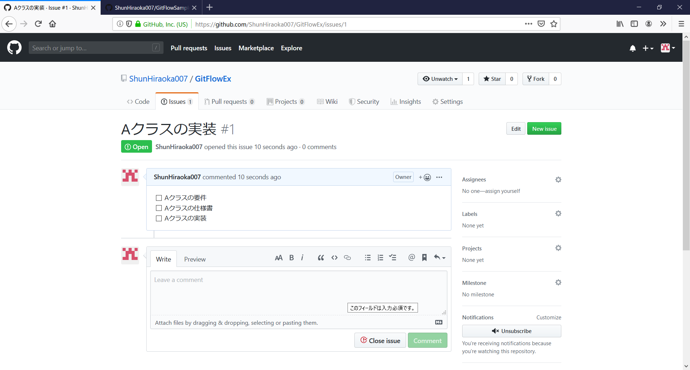

また、`GitHub`や`GitLab`などのホスティングサービスなどでは`Issue`を作成する際に`Markdown`を使うことができます。`Markdown`を使うことで以下のように`Issue`内に`Todoリスト`を作成することもできます。

ex:
- [ ] Aクラスの要件
- [ ] Aクラスの仕様書
- [ ] Aクラスの実装

それでは実際に`Issue`を起こしてみましょう。

まず、`GitHub`の`Issues`をクリックします。

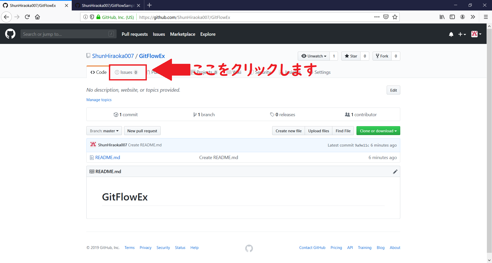

`Issues`をクリックすると以下のように`Issue`の一覧画面に切り替わります。

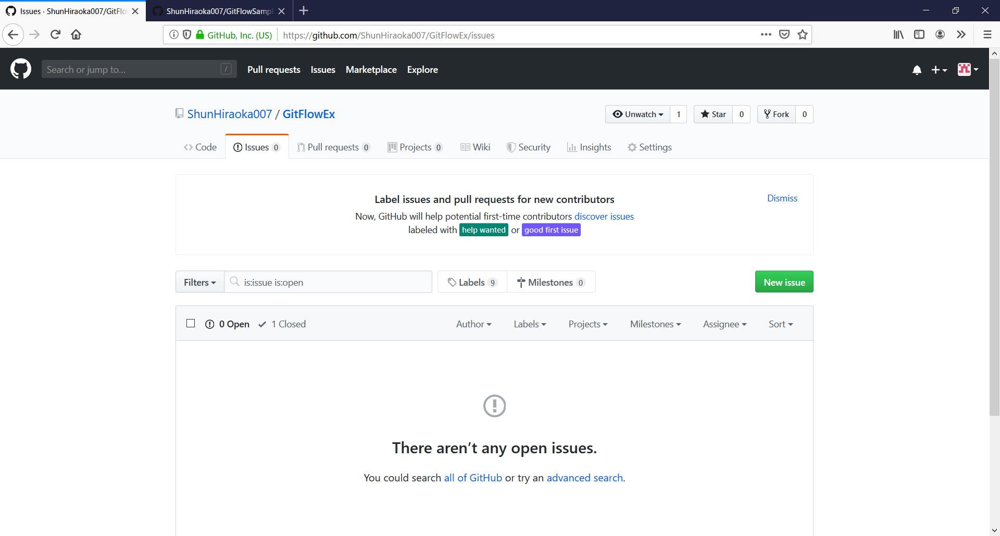

画面内にある`New issue`という緑色のボタンをクリックすると

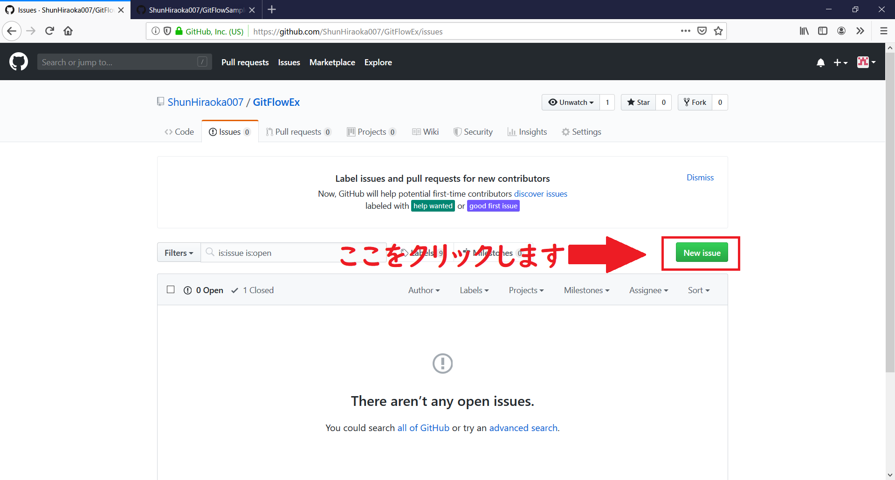

以下のような画面に切り替わります。

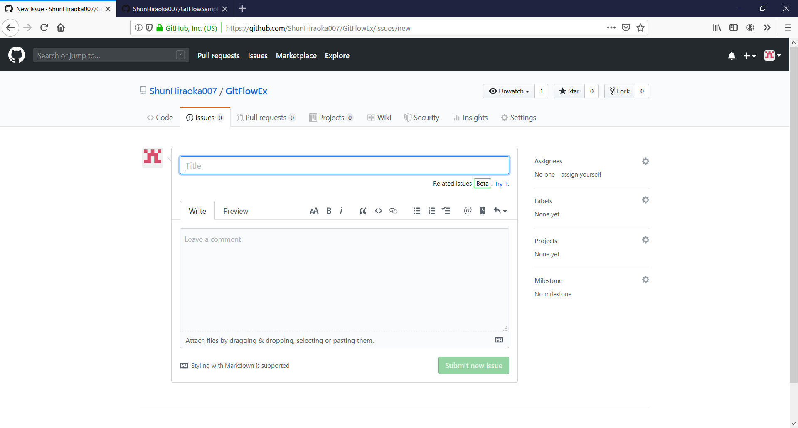

あとは、`Title`などに取り掛かる`Issue`の内容を記入します。

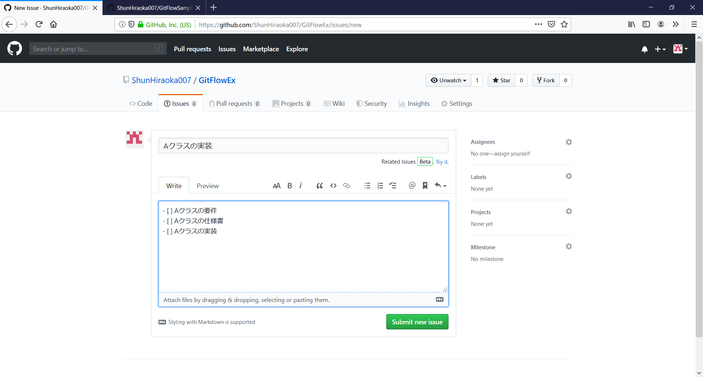

上記のようになっていればOKです

最後に、`Submit new issue`という緑色のボタンをクリックすれば`Issue`が作成されます。

### (2) ブランチを切る

次に、作成した`Issue`に対になるブランチを作成していきます。  
なお、`GitHub`などのホスティングサービスではWeb画面から新規でブランチを作成することもできます。

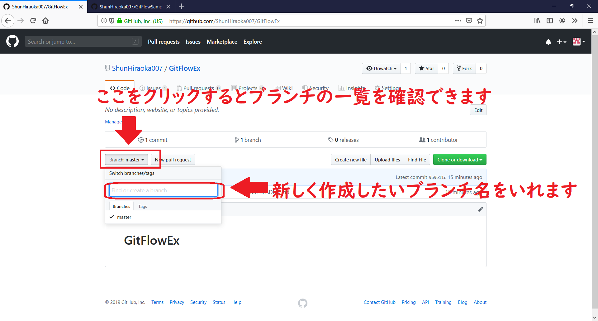

ブランチの作成時に注意が必要なのは、`ブランチ名`から対になる`Issue`が何であるか分かるようにする点です。

例えば「Aというクラスを実装する」という`Issue`があった場合、`Issue`は「Aクラスの実装」となっています。  
ですので、ブランチ名は`add_class_for_A`や`implement_class_A`のようなものにするとわかりやすいでしょう。

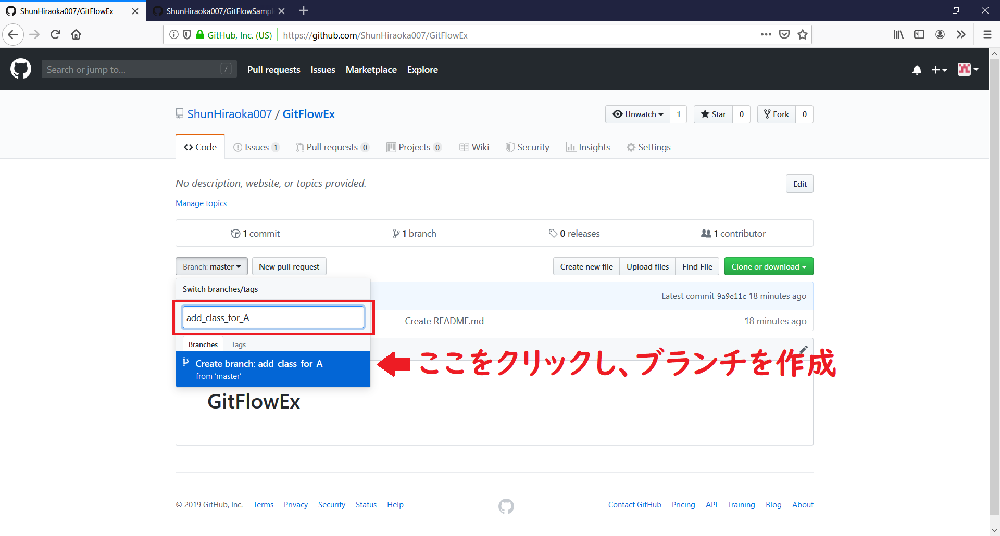

またローカルでブランチを切る場合は、事前に`master`ブランチなどを`pull`しておきましょう。最新の`master`ブランチのコミットを取り込んでおくことでコンフリクトなどを回避しやすくなります。

さらに、`GitHub`や`GitLab`を使用している場合は`Issue`の番号を`add_class_for_A_#1`のようにブランチ名に追加しても良いでしょう。  
`Issue`の番号を追加しておくことで、作成したブランチを`push`した段階で自動的に`Issue`と紐づけを行ってくれます。

### (3) 実装を行う

次に、`Issue`の内容を解消するコードを実装していきます。  
できるだけ小さな単位でのコミットで実装していくと実装の流れが追いやすくなります。ですのでできるだけ小さな粒度でコミットします。

今回は、`add_class_for_A`ブランチに`A.hpp`という`ヘッダーファイル`を作成します。

ます、`Create new file`をクリックして新規ファイルを作成します。

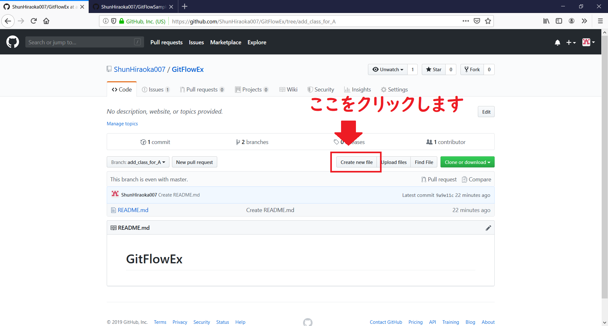

クリック後、以下のような画面に切り替わります。

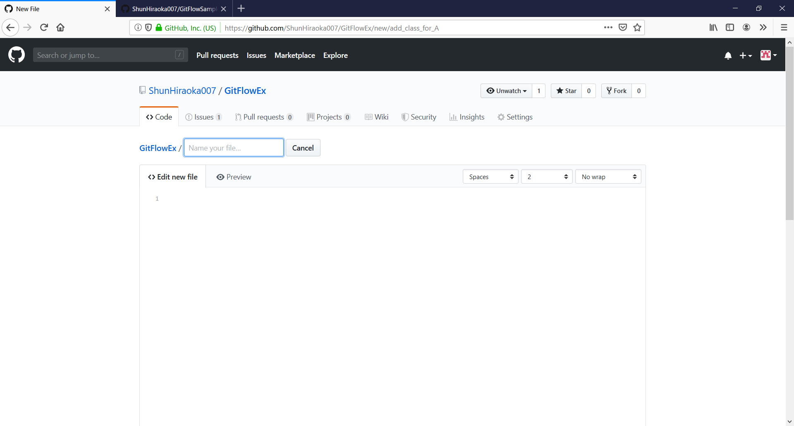

あとは必要なファイル名や実装を記述していきます。

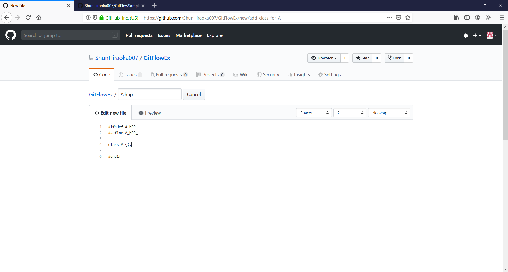

最後に、コミットメッセージを記入します。

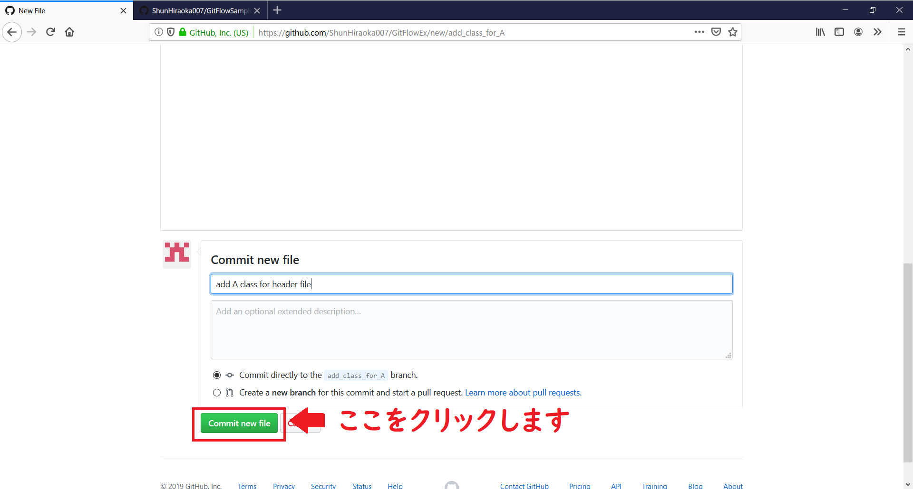

また`GitHub`や`GitLab`などを使用しているケースでは、先ほどのブランチ名と同様にコミットメッセージに`add class A #1`のように`Issue`の番号を追加しておきましょう。  
すると自動的に`Issue`に紐づけられます。  
後から実装の流れを確認することが簡単になりますので、できるだけ`Issue`の番号をコミットメッセージに追加していきましょう。

### (4) プルリクエストを作成し、レビュー

`(3)実装を行う`での作業が完了した後は、手元のブランチをリモートリポジトリにプッシュします。

`GitHub`などのサービスを利用している場合は、`プルリクエスト`という別ブランチの内容を指定のブランチに取り込むという機能が使えます。  
`プルリクエスト`の便利なところは、マージ元とマージ先のブランチ間でのコンフリクトのチェックなどを自動的に行ってくれる点です。  
その為、マージ後にファイルがコンフリクトしているのを修正するなどの手間が省けます。

まずは、リポジトリの画面内にある`Compare & pull request`という緑色のボタンをクリックします。

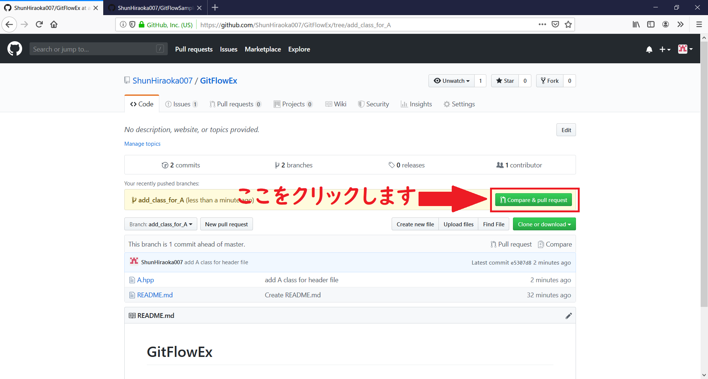

クリックすると新しい`プルリクエスト`が作成されます。

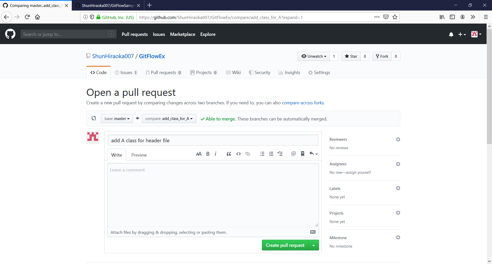

以下のように実装内容などを記入し、`Create pull request`という緑色のボタンをクリックして`プルリクエスト`を作成します。

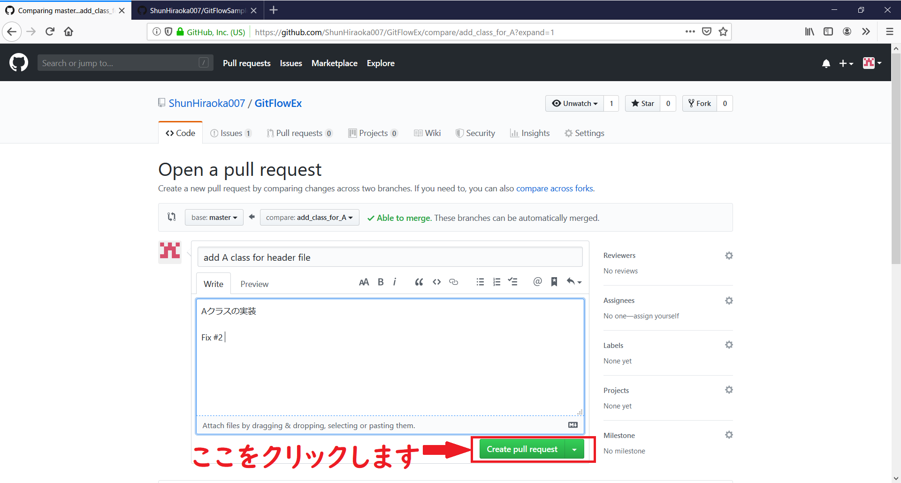

`Fix #2`のように`Fix #<Issueの番号>`を追加することで`プルリクエスト`がマージされた際に自動的に`Issue`が閉じられます。

これにより既に実装が終わっているものの`Issue`は起こされたままという状態を回避できます。

また、`GitHub`や`GitLab`では`CI(継続的インテグレーション)`を使用することができ、作成した`プルリクエスト`の内容に対して自動的にテストを行うこともできます。  
その為、ソースコード自体の品質向上も見込めます。

`プルリクエスト`作成時に、指定のユーザーに対してレビューを要求することもできます。これによりコードを実装した人以外のチェックが入り、事前にミスを見つけることができます。

### (5) マージ

`(4) プルリクエストを作成し、レビュー`が終了したあとは、`プルリクエスト`内にある`マージ`ボタンをクリックします。  

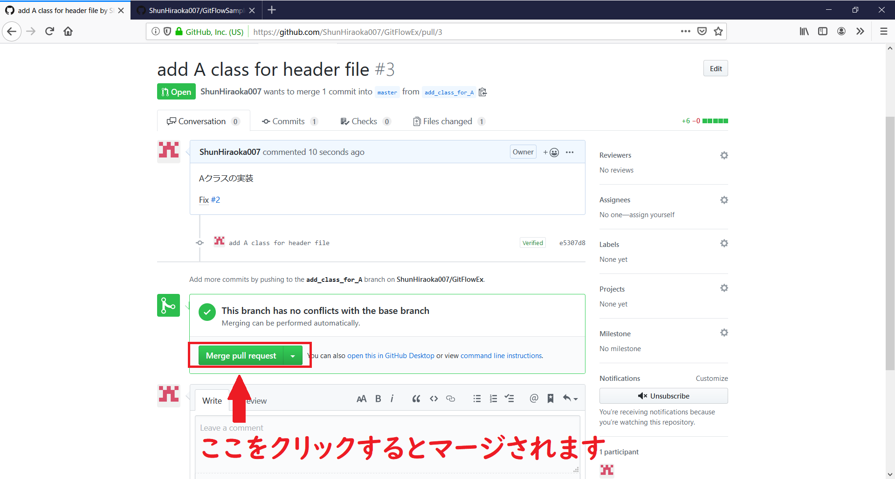

これにより自動的に`master`ブランチなどの主流ブランチに作成した機能がマージされます。

